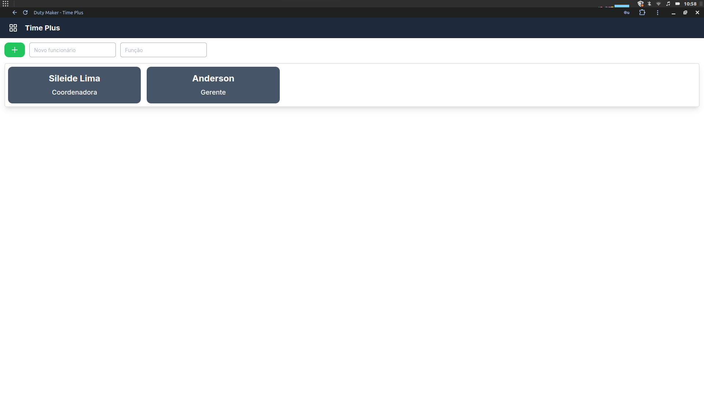
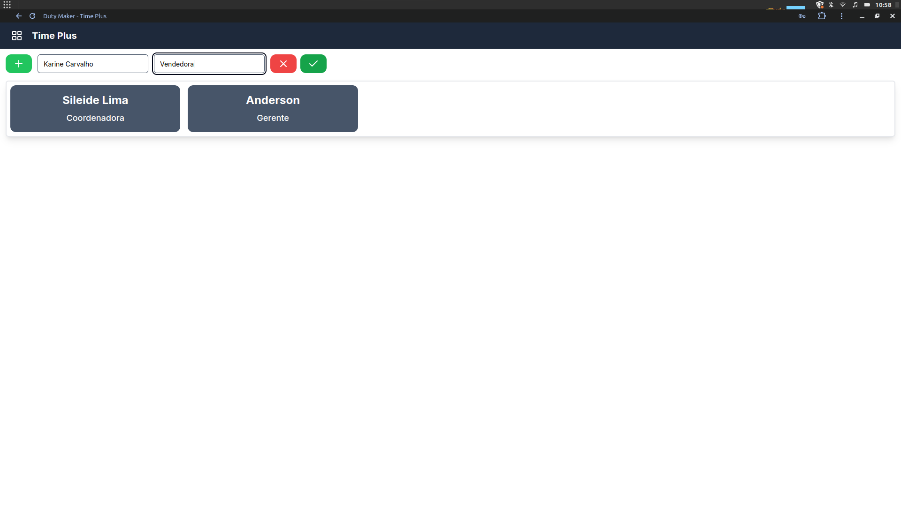
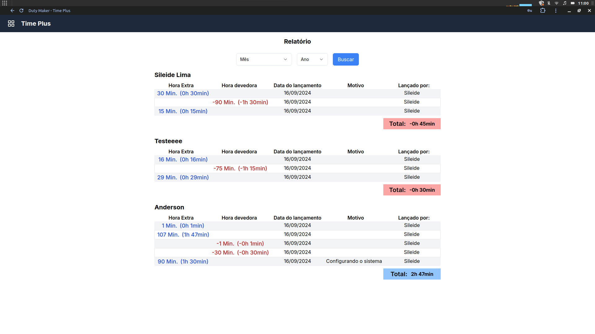
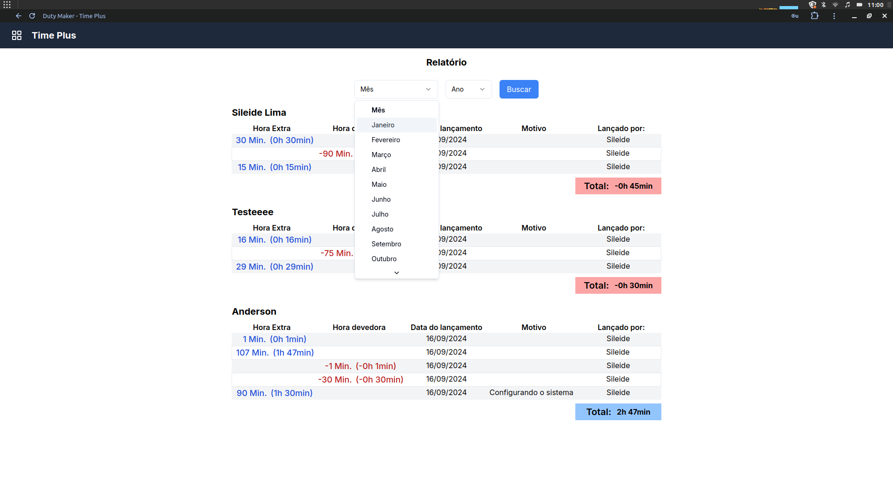
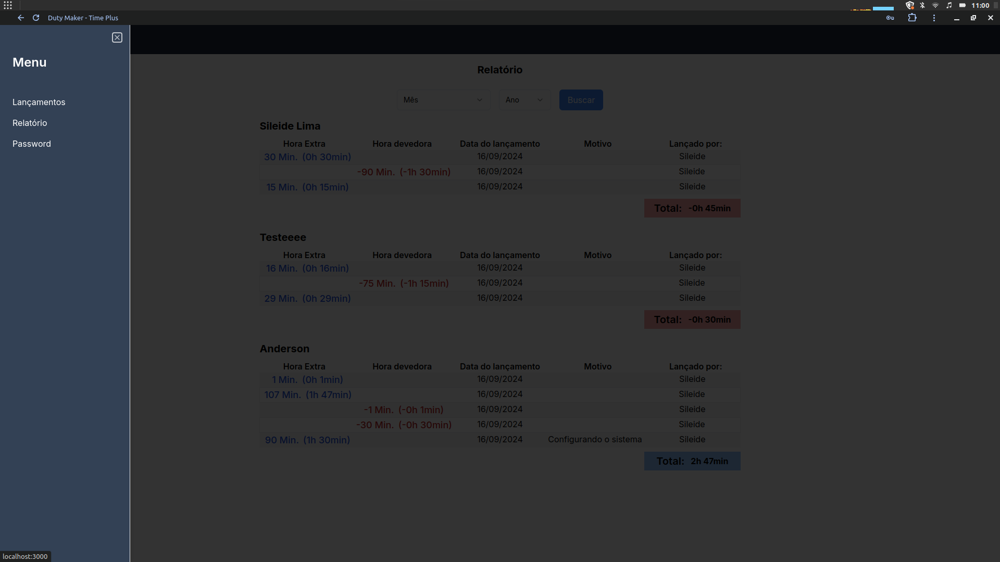
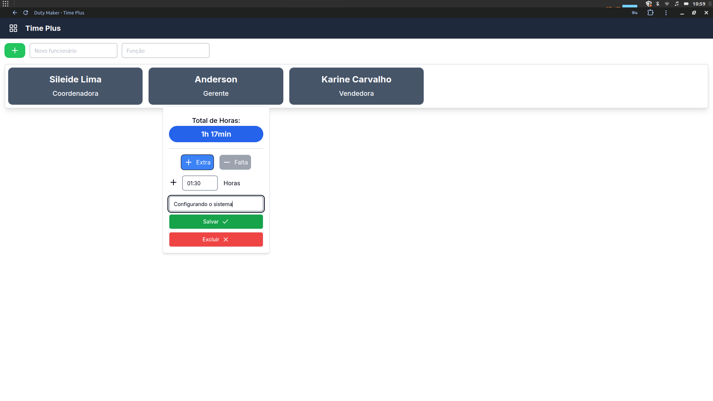
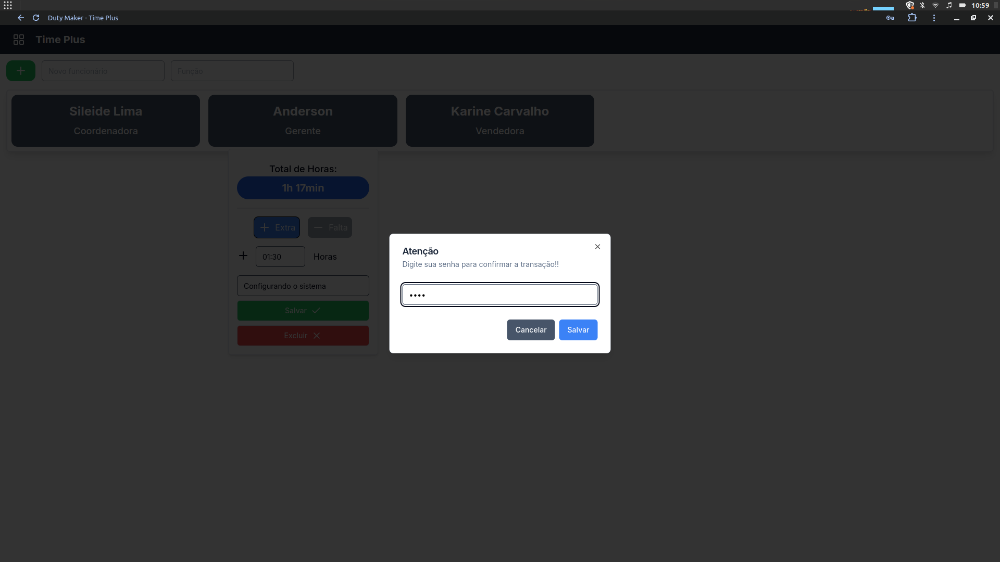

# TimePlus - Lançamento de banco de Horas

Este projeto é uma aplicação de gerenciamento de banco de horas para lojas em geral, criado a partir da necessidade de um cliente real e conforme as suas especificações, com senha para lançamento de horas para que não seja permitido a qualquer um fazer os lançamentos.

## Tecnologias Utilizadas

- **Next.js 14.2.5**: Framework React para construção de aplicações web.
- **Prisma 5.18.0**: ORM utilizado para manipulação do banco de dados.
- **Tailwind CSS 3.4.1**: Framework de CSS utilitário para estilização da interface.
- **Shadcn**: Biblioteca de componentes para uma melhor experiência de usuário.

## Funcionalidades

- **Tela Inicial**: Página principal do aplicativo, onde são listados os colaboradores.
  

- **Adicionar Novo Colaborador**: Interface para adicionar um novo colaborador.
  

- **Visualização de Tarefas**: Página onde são listadas todas as horas lançadas e separadas por colaborador.
  

- **Filtro por Meses**: O sistema trás por padrão todos os lançamentos mas sendo possível aplicar filtros por mês.
  

- **Menu**: Menu drawer com acesso as telas do sistema.
  

- **Lançamento de Horas**: Popup para lançamento das horas, tanto podendo ser positivo ou negativo.
  

- **Senha**: Necessario senha para inserir horas no banco, com exclusividade para deletar e alterar senha apenas para usuários master
  

## Instalação e Configuração

1. Clone este repositório:
   ```bash
   git clone https://github.com/seu-usuario/seu-repositorio.git
   cd seu-repositorio

2. Instale as dependências:
   ```bash
   npm install
   npx prisma migrate dev
   npm run dev

3. Abra http://localhost:3000 no seu navegador para ver o projeto em ação.

Estrutura do Projeto
- /src: Contém o código-fonte da aplicação.
- /prisma: Configurações e migrações do banco de dados Prisma.
- /screenshots: Imagens das principais telas do projeto, utilizadas neste README.
Contribuições
- Contribuições são bem-vindas! Se você encontrar algum problema ou tiver sugestões, sinta-se à vontade para abrir uma issue ou enviar um pull request.

Licença
- Este projeto está licenciado sob a MIT License.

